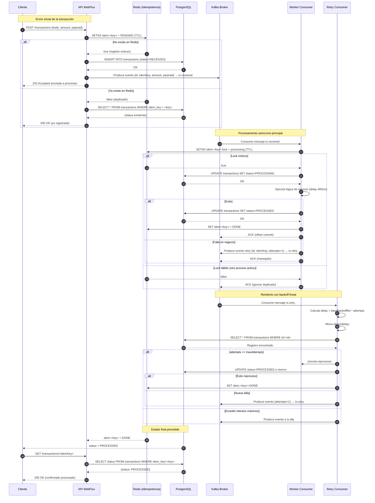

# Laboratorio: Idempotencia + Redis + Postgres + Kafka + Workers (retry)

Este laboratorio implementa un flujo **asíncrono** de procesamiento de transacciones con **idempotencia** usando **Redis** como *dedupe store*, **PostgreSQL** como persistencia, **Kafka** como *bus* de eventos, y **dos consumidores**: uno principal y otro de **reintentos** (backoff + DLQ).

* **API WebFlux** (Spring Boot) recibe la transacción, **responde 202** “enviada a procesar”, persiste el registro con `status=RECEIVED` y publica evento a Kafka.
* **Worker** consume, verifica idempotencia, procesa, actualiza `status=PROCESSED` y emite resultados. Ante error, re-publica a `tx.retry` con contador de intentos; si supera el máximo, envía a `tx.dlq`.

---

## Estructura de proyecto

```text
lab-idempotency/
├─ docker-compose.yml
├─ .env
├─ db/
│  └─ init.sql
├─ api-service/
│  ├─ build.gradle
│  ├─ Dockerfile
│  └─ src/main/java/com/example/api/
│     ├─ ApiApplication.java
│     ├─ config/
│     │  ├─ KafkaConfig.java
│     │  └─ RedisConfig.java
│     ├─ controller/TransactionController.java
│     ├─ dto/{TransactionRequest.java, TransactionResponse.java}
│     ├─ entity/TransactionEntity.java
│     ├─ repo/TransactionRepository.java
│     ├─ service/{IdempotencyService.java, TransactionService.java}
│     └─ resources/application.yml
├─ worker-service/
│  ├─ build.gradle
│  ├─ Dockerfile
│  └─ src/main/java/com/example/worker/
│     ├─ WorkerApplication.java
│     ├─ config/{KafkaConfig.java, RedisConfig.java}
│     ├─ consumer/{TransactionConsumer.java, RetryConsumer.java}
│     ├─ service/{ProcessingService.java, IdempotencyService.java}
│     ├─ entity/TransactionEntity.java
│     ├─ repo/TransactionRepository.java
│     └─ resources/application.yml
└─ README.md
```

## 1) Levantar infraestructura y servicios

```bash
docker compose --env-file .env up -d --build
````

UI útiles:

* Kafka UI → [http://localhost:8081](http://localhost:8081)
* API → [http://localhost:8080](http://localhost:8080)

## 2) Probar flujo

**Crear transacción (sin header genera uno):**

```bash
curl -X POST http://localhost:8080/transactions \
  -H 'Content-Type: application/json' \
  -d '{"amount": 125.50, "payload": {"customerId": "C-123", "note": "purchase"}}'
```

Respuesta: `202 Accepted` con `{ id, status: "RECEIVED", idemKey }`.

**Repetir con el mismo Idempotency-Key (idempotente):**

```bash
curl -X POST http://localhost:8080/transactions \
  -H 'Content-Type: application/json' \
  -H 'Idempotency-Key: <idemKey-devuelto>' \
  -d '{"amount": 125.50, "payload": {"customerId": "C-123", "note": "purchase"}}'
```

Debería devolver el mismo recurso con status actual (`RECEIVED` o `PROCESSED`).

**Consultar por idemKey:**

```bash
curl http://localhost:8080/transactions/<idemKey>
```

## 3) Verificar en Kafka UI

* Topics: `tx.received`, `tx.retry`, `tx.dlq`.

## 4) Notas de idempotencia

* Redis `SETNX` registra `idem:<key>=PENDING` (TTL configurable) para evitar duplicados.
* Worker usa un `lock idem:<key>:lock` para evitar doble proceso concurrente.
* Al terminar, marca `idem:<key>=DONE`.

## 5) Esquema y persistencia

* Tabla `transactions` con `idem_key UNIQUE`.
* Estados posibles: `RECEIVED`, `PROCESSED` (ajústalo si agregas estados intermedios como `FAILED`).

## 6) Reintentos

* Si el `TransactionConsumer` falla, envía al topic `tx.retry` con `attempts+1`.
* `RetryConsumer` aplica **backoff lineal** `baseBackoffMs * attempts`. Si supera `maxAttempts`, envía a `tx.dlq`.

## 7) Extensiones sugeridas

* Backoff exponencial.
* Outbox pattern (tabla outbox + Debezium) para publicar a Kafka con garantía transaccional.
* Observabilidad: Prometheus, Micrometer, logs con correlationId.
* Seguridad y validación de entrada.

```
```

---

## Tips

* Si prefieres **Redpanda** en vez de Kafka+ZK, se puede reemplazar fácilmente el bloque de `kafka` en `docker-compose.yml`.
* Para entornos productivos, considera **Outbox** + **Debezium** para asegurar *exactly-once* entre DB y Kafka.
* El `lock` en Redis está simplificado; para *distributed locks* más avanzados, evalúa Redisson.

## Incluye:

API WebFlux que acepta la transacción y responde 202 Accepted con idempotencia.
- Redis para deduplicación/estado (SETNX + TTL y lock).
- Postgres (R2DBC) para persistencia de transactions.
- Kafka con topics tx.received, tx.retry, tx.dlq.
- Worker principal + Retry consumer con backoff y DLQ.
- docker-compose.yml, .env, init.sql, build.gradle (Groovy), Dockerfiles y curl de prueba.



### Explicación detallada del flujo

1. **Cliente → API:** envía transacción vía POST.
2. **API → Redis:** intenta registrar clave idempotente (`SETNX`).
3. Si es nuevo, **inserta en Postgres** y **publica evento Kafka** (`tx.received`).
4. API responde `202 Accepted` inmediatamente (procesamiento asíncrono).
5. **Worker** consume `tx.received`, obtiene lock en Redis (`SETNX idem:<key>:lock`).
6. Si logra el lock, cambia estado a `PROCESSING`, ejecuta la lógica y marca `PROCESSED`.
7. Si ocurre error, publica evento `tx.retry` con `attempts+1`.
8. **Retry Consumer** aplica backoff (`delay = baseBackoffMs * attempts`) y reintenta.
9. Si supera `maxAttempts`, el mensaje se mueve a **Dead Letter Queue (tx.dlq)**.
10. Cliente puede consultar su transacción en cualquier momento (`GET /transactions/<key>`).

**Garantías clave:**

* Redis asegura **idempotencia (SETNX)** y **locks distribuidos**.
* Postgres mantiene persistencia del estado.
* Kafka garantiza entrega asíncrona.
* Workers independientes manejan **reintentos con backoff** y **DLQ** para resiliencia.

