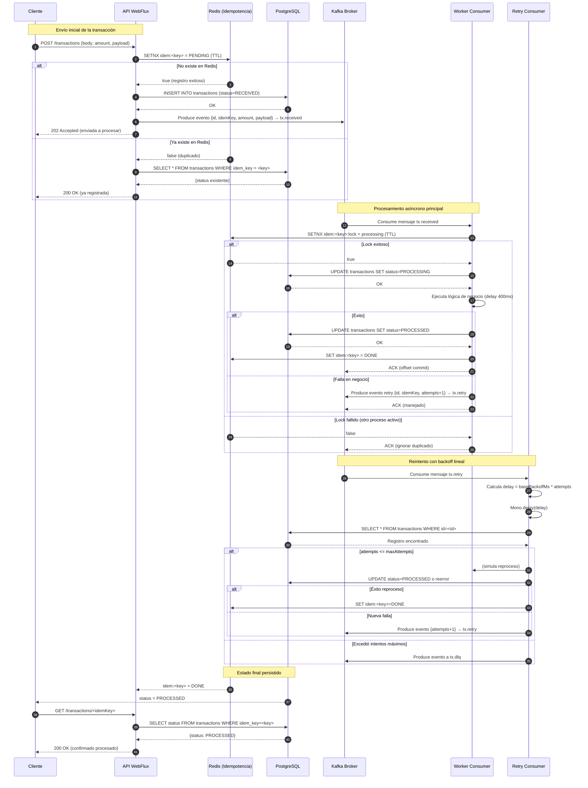

# 🧪 Laboratorio completo: Idempotencia + Redis + Postgres + Kafka + Workers (retry)

Este laboratorio implementa un flujo **asíncrono** de procesamiento de transacciones con **idempotencia** usando **Redis** como *dedupe store*, **PostgreSQL** como persistencia, **Kafka** como *bus* de eventos, y **dos consumidores**: uno principal y otro de **reintentos** (backoff + DLQ).

* **API WebFlux** (Spring Boot) recibe la transacción, **responde 202** “enviada a procesar”, persiste el registro con `status=RECEIVED` y publica evento a Kafka.
* **Worker** consume, verifica idempotencia, procesa, actualiza `status=PROCESSED` y emite resultados. Ante error, re-publica a `tx.retry` con contador de intentos; si supera el máximo, envía a `tx.dlq`.

---

## Estructura de proyecto

```
lab-idempotency/
├─ docker-compose.yml
├─ .env
├─ db/
│  └─ init.sql
├─ api-service/
│  ├─ build.gradle
│  ├─ Dockerfile
│  └─ src/main/java/com/example/api/
│     ├─ ApiApplication.java
│     ├─ config/
│     │  ├─ KafkaConfig.java
│     │  └─ RedisConfig.java
│     ├─ controller/TransactionController.java
│     ├─ dto/{TransactionRequest.java, TransactionResponse.java}
│     ├─ entity/TransactionEntity.java
│     ├─ repo/TransactionRepository.java
│     ├─ service/{IdempotencyService.java, TransactionService.java}
│     └─ resources/application.yml
├─ worker-service/
│  ├─ build.gradle
│  ├─ Dockerfile
│  └─ src/main/java/com/example/worker/
│     ├─ WorkerApplication.java
│     ├─ config/{KafkaConfig.java, RedisConfig.java}
│     ├─ consumer/{TransactionConsumer.java, RetryConsumer.java}
│     ├─ service/{ProcessingService.java, IdempotencyService.java}
│     ├─ entity/TransactionEntity.java
│     ├─ repo/TransactionRepository.java
│     └─ resources/application.yml
└─ README.md
```

---

## docker-compose.yml

```yaml
version: "3.9"
services:
  postgres:
    image: postgres:16
    container_name: pg
    environment:
      POSTGRES_DB: ${POSTGRES_DB}
      POSTGRES_USER: ${POSTGRES_USER}
      POSTGRES_PASSWORD: ${POSTGRES_PASSWORD}
    ports:
      - "5432:5432"
    volumes:
      - ./db/init.sql:/docker-entrypoint-initdb.d/init.sql:ro
    healthcheck:
      test: ["CMD-SHELL", "pg_isready -U $$POSTGRES_USER -d $$POSTGRES_DB"]
      interval: 5s
      retries: 20

  redis:
    image: redis:7
    container_name: redis
    ports:
      - "6379:6379"
    command: ["redis-server", "--appendonly", "yes"]
    healthcheck:
      test: ["CMD", "redis-cli", "ping"]
      interval: 5s
      retries: 20

  zookeeper:
    image: bitnami/zookeeper:3.9
    environment:
      - ALLOW_ANONYMOUS_LOGIN=yes
    ports: ["2181:2181"]

  kafka:
    image: bitnami/kafka:3.7
    depends_on:
      - zookeeper
    environment:
      - KAFKA_CFG_ZOOKEEPER_CONNECT=zookeeper:2181
      - KAFKA_CFG_LISTENERS=PLAINTEXT://:9092,PLAINTEXT_HOST://:29092
      - KAFKA_CFG_ADVERTISED_LISTENERS=PLAINTEXT://kafka:9092,PLAINTEXT_HOST://localhost:29092
      - KAFKA_CFG_AUTO_CREATE_TOPICS_ENABLE=true
      - ALLOW_PLAINTEXT_LISTENER=yes
    ports:
      - "9092:29092"

  kafka-ui:
    image: provectuslabs/kafka-ui:latest
    depends_on: [kafka]
    ports:
      - "8081:8080"
    environment:
      - KAFKA_CLUSTERS_0_NAME=local
      - KAFKA_CLUSTERS_0_BOOTSTRAPSERVERS=kafka:9092

  api-service:
    build: ./api-service
    depends_on:
      postgres:
        condition: service_healthy
      redis:
        condition: service_healthy
      kafka:
        condition: service_started
    environment:
      - SPRING_PROFILES_ACTIVE=docker
      - KAFKA_BOOTSTRAP_SERVERS=kafka:9092
      - SPRING_R2DBC_URL=r2dbc:postgresql://postgres:5432/${POSTGRES_DB}
      - SPRING_R2DBC_USERNAME=${POSTGRES_USER}
      - SPRING_R2DBC_PASSWORD=${POSTGRES_PASSWORD}
      - SPRING_REDIS_HOST=redis
      - SPRING_REDIS_PORT=6379
    ports:
      - "8080:8080"

  worker-service:
    build: ./worker-service
    depends_on:
      postgres:
        condition: service_healthy
      redis:
        condition: service_healthy
      kafka:
        condition: service_started
    environment:
      - SPRING_PROFILES_ACTIVE=docker
      - KAFKA_BOOTSTRAP_SERVERS=kafka:9092
      - SPRING_R2DBC_URL=r2dbc:postgresql://postgres:5432/${POSTGRES_DB}
      - SPRING_R2DBC_USERNAME=${POSTGRES_USER}
      - SPRING_R2DBC_PASSWORD=${POSTGRES_PASSWORD}
      - SPRING_REDIS_HOST=redis
      - SPRING_REDIS_PORT=6379
```

### .env

```dotenv
POSTGRES_DB=txdb
POSTGRES_USER=txuser
POSTGRES_PASSWORD=txpass
```

### db/init.sql

```sql
create table if not exists transactions (
  id uuid primary key,
  idem_key varchar(120) not null unique,
  amount numeric(18,2) not null,
  payload jsonb not null,
  status varchar(32) not null,
  attempts int not null default 0,
  created_at timestamptz not null default now(),
  updated_at timestamptz not null default now()
);

create index if not exists idx_transactions_status on transactions(status);
```

---

## API Service (Spring Boot WebFlux)

### api-service/build.gradle (Groovy)

```groovy
plugins {
  id 'java'
  id 'org.springframework.boot' version '3.3.5'
  id 'io.spring.dependency-management' version '1.1.6'
}

group = 'com.example'
version = '0.0.1-SNAPSHOT'
java { toolchain { languageVersion = JavaLanguageVersion.of(21) } }

repositories { mavenCentral() }

dependencies {
  implementation 'org.springframework.boot:spring-boot-starter-webflux'
  implementation 'org.springframework.boot:spring-boot-starter-data-r2dbc'
  implementation 'org.springframework.boot:spring-boot-starter-data-redis-reactive'
  implementation 'org.springframework.kafka:spring-kafka'
  runtimeOnly 'org.postgresql:r2dbc-postgresql'
  implementation 'io.projectreactor:reactor-core'
  compileOnly 'org.projectlombok:lombok'
  annotationProcessor 'org.projectlombok:lombok'
  testImplementation 'org.springframework.boot:spring-boot-starter-test'
  testImplementation 'io.projectreactor:reactor-test'
}

tasks.test { useJUnitPlatform() }
```

### api-service/Dockerfile

```dockerfile
FROM eclipse-temurin:21-jdk AS build
WORKDIR /app
COPY build.gradle settings.gradle* gradlew ./
COPY gradle gradle
RUN ./gradlew --no-daemon dependencies || true
COPY . .
RUN ./gradlew --no-daemon clean bootJar

FROM eclipse-temurin:21-jre
WORKDIR /app
COPY --from=build /app/build/libs/*.jar app.jar
EXPOSE 8080
ENTRYPOINT ["java","-jar","/app/app.jar"]
```

### src/main/resources/application.yml

```yaml
server:
  port: 8080
spring:
  r2dbc:
    url: ${SPRING_R2DBC_URL:r2dbc:postgresql://localhost:5432/txdb}
    username: ${SPRING_R2DBC_USERNAME:txuser}
    password: ${SPRING_R2DBC_PASSWORD:txpass}
  data:
    redis:
      host: ${SPRING_REDIS_HOST:localhost}
      port: ${SPRING_REDIS_PORT:6379}
      timeout: 2s
  kafka:
    bootstrap-servers: ${KAFKA_BOOTSTRAP_SERVERS:localhost:29092}
    producer:
      key-serializer: org.apache.kafka.common.serialization.StringSerializer
      value-serializer: org.springframework.kafka.support.serializer.JsonSerializer
      properties:
        spring.json.add.type.headers: false
app:
  kafka:
    topics:
      received: tx.received
      retry: tx.retry
      dlq: tx.dlq
  idempotency:
    ttlSeconds: 3600
```

### ApiApplication.java

```java
package com.example.api;

import org.springframework.boot.SpringApplication;
import org.springframework.boot.autoconfigure.SpringBootApplication;

@SpringBootApplication
public class ApiApplication {
  public static void main(String[] args) { SpringApplication.run(ApiApplication.class, args); }
}
```

### config/KafkaConfig.java

```java
package com.example.api.config;

import org.apache.kafka.clients.admin.NewTopic;
import org.springframework.beans.factory.annotation.Value;
import org.springframework.context.annotation.Bean;
import org.springframework.context.annotation.Configuration;
import org.springframework.kafka.config.TopicBuilder;
import org.springframework.kafka.core.KafkaTemplate;
import org.springframework.kafka.core.DefaultKafkaProducerFactory;
import org.springframework.kafka.core.ProducerFactory;
import org.springframework.kafka.support.serializer.JsonSerializer;
import org.apache.kafka.common.serialization.StringSerializer;

import java.util.Map;

@Configuration
public class KafkaConfig {
  @Value("${spring.kafka.bootstrap-servers}")
  private String bootstrap;

  @Value("${app.kafka.topics.received}")
  private String received;
  @Value("${app.kafka.topics.retry}")
  private String retry;
  @Value("${app.kafka.topics.dlq}")
  private String dlq;

  @Bean
  public ProducerFactory<String, Object> producerFactory() {
    Map<String, Object> props = Map.of(
        org.apache.kafka.clients.producer.ProducerConfig.BOOTSTRAP_SERVERS_CONFIG, bootstrap,
        org.apache.kafka.clients.producer.ProducerConfig.KEY_SERIALIZER_CLASS_CONFIG, StringSerializer.class,
        org.apache.kafka.clients.producer.ProducerConfig.VALUE_SERIALIZER_CLASS_CONFIG, JsonSerializer.class
    );
    return new DefaultKafkaProducerFactory<>(props);
  }

  @Bean
  public KafkaTemplate<String, Object> kafkaTemplate() { return new KafkaTemplate<>(producerFactory()); }

  @Bean NewTopic topicReceived() { return TopicBuilder.name(received).partitions(3).replicas(1).build(); }
  @Bean NewTopic topicRetry() { return TopicBuilder.name(retry).partitions(3).replicas(1).build(); }
  @Bean NewTopic topicDlq() { return TopicBuilder.name(dlq).partitions(1).replicas(1).build(); }
}
```

### config/RedisConfig.java

```java
package com.example.api.config;

import org.springframework.context.annotation.Bean;
import org.springframework.context.annotation.Configuration;
import org.springframework.data.redis.connection.ReactiveRedisConnectionFactory;
import org.springframework.data.redis.connection.lettuce.LettuceConnectionFactory;
import org.springframework.data.redis.core.ReactiveStringRedisTemplate;
import org.springframework.data.redis.serializer.StringRedisSerializer;

@Configuration
public class RedisConfig {
  @Bean
  public ReactiveRedisConnectionFactory redisConnectionFactory() { return new LettuceConnectionFactory(); }

  @Bean
  public ReactiveStringRedisTemplate reactiveStringRedisTemplate(ReactiveRedisConnectionFactory cf) {
    var template = new ReactiveStringRedisTemplate(cf);
    template.setKeySerializer(StringRedisSerializer.UTF_8);
    template.setValueSerializer(StringRedisSerializer.UTF_8);
    return template;
  }
}
```

### dto/TransactionRequest.java

```java
package com.example.api.dto;

import java.math.BigDecimal;
import java.util.Map;

public record TransactionRequest(BigDecimal amount, Map<String, Object> payload) {}
```

### dto/TransactionResponse.java

```java
package com.example.api.dto;

public record TransactionResponse(String id, String status, String idemKey) {}
```

### entity/TransactionEntity.java

```java
package com.example.api.entity;

import org.springframework.data.annotation.Id;
import org.springframework.data.relational.core.mapping.Table;
import org.springframework.data.relational.core.mapping.Column;

import java.math.BigDecimal;
import java.time.OffsetDateTime;
import java.util.UUID;

@Table("transactions")
public class TransactionEntity {
  @Id public UUID id;
  @Column("idem_key") public String idemKey;
  public BigDecimal amount;
  public String payload; // JSON string
  public String status;
  public Integer attempts;
  @Column("created_at") public OffsetDateTime createdAt;
  @Column("updated_at") public OffsetDateTime updatedAt;
}
```

### repo/TransactionRepository.java

```java
package com.example.api.repo;

import com.example.api.entity.TransactionEntity;
import org.springframework.data.r2dbc.repository.Query;
import org.springframework.data.repository.reactive.ReactiveCrudRepository;
import reactor.core.publisher.Mono;

import java.util.UUID;

public interface TransactionRepository extends ReactiveCrudRepository<TransactionEntity, UUID> {
  Mono<TransactionEntity> findByIdemKey(String idemKey);

  @Query("update transactions set status=:status, updated_at=now() where id=:id returning *")
  Mono<TransactionEntity> updateStatus(UUID id, String status);
}
```

### service/IdempotencyService.java

```java
package com.example.api.service;

import org.springframework.beans.factory.annotation.Value;
import org.springframework.data.redis.core.ReactiveStringRedisTemplate;
import org.springframework.stereotype.Service;
import reactor.core.publisher.Mono;

import java.time.Duration;

@Service
public class IdempotencyService {
  private final ReactiveStringRedisTemplate redis;
  private final Duration ttl;
  public IdempotencyService(ReactiveStringRedisTemplate redis,
                            @Value("${app.idempotency.ttlSeconds:3600}") long ttlSeconds) {
    this.redis = redis; this.ttl = Duration.ofSeconds(ttlSeconds);
  }

  // Devuelve true si pudo registrar (no existía)
  public Mono<Boolean> tryRegister(String key) {
    String redisKey = "idem:" + key;
    return redis.opsForValue().setIfAbsent(redisKey, "PENDING", ttl)
        .map(Boolean::booleanValue);
  }

  public Mono<Void> markDone(String key) {
    return redis.opsForValue().set("idem:"+key, "DONE", ttl).then();
  }
}
```

### service/TransactionService.java

```java
package com.example.api.service;

import com.example.api.dto.TransactionRequest;
import com.example.api.dto.TransactionResponse;
import com.example.api.entity.TransactionEntity;
import com.example.api.repo.TransactionRepository;
import com.fasterxml.jackson.core.JsonProcessingException;
import com.fasterxml.jackson.databind.ObjectMapper;
import org.springframework.kafka.core.KafkaTemplate;
import org.springframework.stereotype.Service;
import reactor.core.publisher.Mono;

import java.math.BigDecimal;
import java.util.Map;
import java.util.UUID;

@Service
public class TransactionService {
  private final TransactionRepository repo;
  private final IdempotencyService idem;
  private final KafkaTemplate<String, Object> kafka;
  private final ObjectMapper mapper = new ObjectMapper();
  private final String topicReceived = "tx.received";

  public TransactionService(TransactionRepository repo, IdempotencyService idem, KafkaTemplate<String, Object> kafka) {
    this.repo = repo; this.idem = idem; this.kafka = kafka;
  }

  public Mono<TransactionResponse> accept(String idemKey, TransactionRequest req) {
    return idem.tryRegister(idemKey)
      .flatMap(registered -> registered ? createAndPublish(idemKey, req) : findExisting(idemKey));
  }

  private Mono<TransactionResponse> createAndPublish(String idemKey, TransactionRequest req) {
    var e = new TransactionEntity();
    e.id = UUID.randomUUID();
    e.idemKey = idemKey;
    e.amount = req.amount() == null ? BigDecimal.ZERO : req.amount();
    try { e.payload = mapper.writeValueAsString(req.payload()==null?Map.of():req.payload()); }
    catch (JsonProcessingException ex) { return Mono.error(ex); }
    e.status = "RECEIVED"; e.attempts = 0;

    return repo.save(e)
      .doOnSuccess(saved -> kafka.send(topicReceived, saved.idemKey, Map.of(
          "id", saved.id.toString(),
          "idemKey", saved.idemKey,
          "amount", saved.amount,
          "payload", req.payload()
      )))
      .map(saved -> new TransactionResponse(saved.id.toString(), saved.status, saved.idemKey));
  }

  private Mono<TransactionResponse> findExisting(String idemKey) {
    return repo.findByIdemKey(idemKey)
      .map(t -> new TransactionResponse(t.id.toString(), t.status, t.idemKey));
  }
}
```

### controller/TransactionController.java

```java
package com.example.api.controller;

import com.example.api.dto.TransactionRequest;
import com.example.api.dto.TransactionResponse;
import com.example.api.service.TransactionService;
import org.springframework.http.HttpStatus;
import org.springframework.http.ResponseEntity;
import org.springframework.web.bind.annotation.*;
import reactor.core.publisher.Mono;

import java.util.UUID;

@RestController
@RequestMapping("/transactions")
public class TransactionController {
  private final TransactionService service;
  public TransactionController(TransactionService service){ this.service = service; }

  @PostMapping
  public Mono<ResponseEntity<TransactionResponse>> create(@RequestHeader(name="Idempotency-Key", required=false) String idem,
                                                          @RequestBody TransactionRequest req){
    String key = (idem==null||idem.isBlank()) ? UUID.randomUUID().toString() : idem;
    return service.accept(key, req).map(body -> ResponseEntity.accepted().body(body));
  }

  @GetMapping("/{idemKey}")
  public Mono<ResponseEntity<TransactionResponse>> get(@PathVariable String idemKey){
    return service.accept(idemKey, new TransactionRequest(null, null))
      .map(ResponseEntity::ok);
  }
}
```

---

## Worker Service (Spring Boot)

### worker-service/build.gradle

```groovy
plugins {
  id 'java'
  id 'org.springframework.boot' version '3.3.5'
  id 'io.spring.dependency-management' version '1.1.6'
}

group = 'com.example'
version = '0.0.1-SNAPSHOT'
java { toolchain { languageVersion = JavaLanguageVersion.of(21) } }

repositories { mavenCentral() }

dependencies {
  implementation 'org.springframework.boot:spring-boot-starter'
  implementation 'org.springframework.boot:spring-boot-starter-data-r2dbc'
  runtimeOnly 'org.postgresql:r2dbc-postgresql'
  implementation 'org.springframework.kafka:spring-kafka'
  implementation 'org.springframework.boot:spring-boot-starter-data-redis-reactive'
  implementation 'io.projectreactor:reactor-core'
  compileOnly 'org.projectlombok:lombok'
  annotationProcessor 'org.projectlombok:lombok'
  testImplementation 'org.springframework.boot:spring-boot-starter-test'
}

tasks.test { useJUnitPlatform() }
```

### worker-service/Dockerfile

```dockerfile
FROM eclipse-temurin:21-jdk AS build
WORKDIR /app
COPY build.gradle settings.gradle* gradlew ./
COPY gradle gradle
RUN ./gradlew --no-daemon dependencies || true
COPY . .
RUN ./gradlew --no-daemon clean bootJar

FROM eclipse-temurin:21-jre
WORKDIR /app
COPY --from=build /app/build/libs/*.jar app.jar
ENTRYPOINT ["java","-jar","/app/app.jar"]
```

### src/main/resources/application.yml

```yaml
spring:
  r2dbc:
    url: ${SPRING_R2DBC_URL:r2dbc:postgresql://localhost:5432/txdb}
    username: ${SPRING_R2DBC_USERNAME:txuser}
    password: ${SPRING_R2DBC_PASSWORD:txpass}
  kafka:
    bootstrap-servers: ${KAFKA_BOOTSTRAP_SERVERS:localhost:29092}
    consumer:
      group-id: worker
      key-deserializer: org.apache.kafka.common.serialization.StringDeserializer
      value-deserializer: org.springframework.kafka.support.serializer.JsonDeserializer
      properties:
        spring.json.trusted.packages: "*"
        spring.json.value.default.type: java.util.Map
  data:
    redis:
      host: ${SPRING_REDIS_HOST:localhost}
      port: ${SPRING_REDIS_PORT:6379}

app:
  kafka:
    topics:
      received: tx.received
      retry: tx.retry
      dlq: tx.dlq
  retry:
    maxAttempts: 3
    baseBackoffMs: 2000
  idempotency:
    ttlSeconds: 3600
```

### WorkerApplication.java

```java
package com.example.worker;

import org.springframework.boot.SpringApplication;
import org.springframework.boot.autoconfigure.SpringBootApplication;

@SpringBootApplication
public class WorkerApplication {
  public static void main(String[] args) { SpringApplication.run(WorkerApplication.class, args); }
}
```

### config/KafkaConfig.java

```java
package com.example.worker.config;

import org.apache.kafka.clients.admin.NewTopic;
import org.springframework.beans.factory.annotation.Value;
import org.springframework.context.annotation.Bean;
import org.springframework.context.annotation.Configuration;
import org.springframework.kafka.config.ConcurrentKafkaListenerContainerFactory;
import org.springframework.kafka.config.TopicBuilder;
import org.springframework.kafka.core.ConsumerFactory;
import org.springframework.kafka.core.DefaultKafkaConsumerFactory;
import org.springframework.kafka.core.DefaultKafkaProducerFactory;
import org.springframework.kafka.core.KafkaTemplate;
import org.springframework.kafka.core.ProducerFactory;
import org.springframework.kafka.support.serializer.JsonDeserializer;
import org.springframework.kafka.support.serializer.JsonSerializer;
import org.apache.kafka.common.serialization.StringDeserializer;
import org.apache.kafka.common.serialization.StringSerializer;

import java.util.Map;

@Configuration
public class KafkaConfig {
  @Value("${spring.kafka.bootstrap-servers}") String bootstrap;
  @Value("${app.kafka.topics.received}") String received;
  @Value("${app.kafka.topics.retry}") String retry;
  @Value("${app.kafka.topics.dlq}") String dlq;

  @Bean
  public ConsumerFactory<String, Object> consumerFactory() {
    Map<String, Object> props = Map.of(
      org.apache.kafka.clients.consumer.ConsumerConfig.BOOTSTRAP_SERVERS_CONFIG, bootstrap,
      org.apache.kafka.clients.consumer.ConsumerConfig.GROUP_ID_CONFIG, "worker",
      org.apache.kafka.clients.consumer.ConsumerConfig.KEY_DESERIALIZER_CLASS_CONFIG, StringDeserializer.class,
      org.apache.kafka.clients.consumer.ConsumerConfig.VALUE_DESERIALIZER_CLASS_CONFIG, JsonDeserializer.class,
      JsonDeserializer.TRUSTED_PACKAGES, "*"
    );
    return new DefaultKafkaConsumerFactory<>(props);
  }

  @Bean
  public ConcurrentKafkaListenerContainerFactory<String, Object> kafkaListenerContainerFactory() {
    var factory = new ConcurrentKafkaListenerContainerFactory<String, Object>();
    factory.setConsumerFactory(consumerFactory());
    factory.setConcurrency(3);
    return factory;
  }

  @Bean
  public ProducerFactory<String, Object> producerFactory() {
    Map<String, Object> props = Map.of(
      org.apache.kafka.clients.producer.ProducerConfig.BOOTSTRAP_SERVERS_CONFIG, bootstrap,
      org.apache.kafka.clients.producer.ProducerConfig.KEY_SERIALIZER_CLASS_CONFIG, StringSerializer.class,
      org.apache.kafka.clients.producer.ProducerConfig.VALUE_SERIALIZER_CLASS_CONFIG, JsonSerializer.class
    );
    return new DefaultKafkaProducerFactory<>(props);
  }
  @Bean public KafkaTemplate<String,Object> kafkaTemplate(){ return new KafkaTemplate<>(producerFactory()); }

  @Bean NewTopic topicReceived() { return TopicBuilder.name(received).partitions(3).replicas(1).build(); }
  @Bean NewTopic topicRetry() { return TopicBuilder.name(retry).partitions(3).replicas(1).build(); }
  @Bean NewTopic topicDlq() { return TopicBuilder.name(dlq).partitions(1).replicas(1).build(); }
}
```

### config/RedisConfig.java

```java
package com.example.worker.config;

import org.springframework.context.annotation.Bean;
import org.springframework.context.annotation.Configuration;
import org.springframework.data.redis.connection.ReactiveRedisConnectionFactory;
import org.springframework.data.redis.connection.lettuce.LettuceConnectionFactory;
import org.springframework.data.redis.core.ReactiveStringRedisTemplate;
import org.springframework.data.redis.serializer.StringRedisSerializer;

@Configuration
public class RedisConfig {
  @Bean public ReactiveRedisConnectionFactory redisConnectionFactory() { return new LettuceConnectionFactory(); }
  @Bean public ReactiveStringRedisTemplate reactiveStringRedisTemplate(ReactiveRedisConnectionFactory cf) {
    var t = new ReactiveStringRedisTemplate(cf);
    t.setKeySerializer(StringRedisSerializer.UTF_8);
    t.setValueSerializer(StringRedisSerializer.UTF_8);
    return t;
  }
}
```

### entity/TransactionEntity.java

```java
package com.example.worker.entity;

import org.springframework.data.annotation.Id;
import org.springframework.data.relational.core.mapping.Table;
import org.springframework.data.relational.core.mapping.Column;

import java.math.BigDecimal;
import java.time.OffsetDateTime;
import java.util.UUID;

@Table("transactions")
public class TransactionEntity {
  @Id public UUID id;
  @Column("idem_key") public String idemKey;
  public BigDecimal amount;
  public String payload; // JSON
  public String status;
  public Integer attempts;
  @Column("created_at") public OffsetDateTime createdAt;
  @Column("updated_at") public OffsetDateTime updatedAt;
}
```

### repo/TransactionRepository.java

```java
package com.example.worker.repo;

import com.example.worker.entity.TransactionEntity;
import org.springframework.data.r2dbc.repository.Query;
import org.springframework.data.repository.reactive.ReactiveCrudRepository;
import reactor.core.publisher.Mono;

import java.util.UUID;

public interface TransactionRepository extends ReactiveCrudRepository<TransactionEntity, UUID> {
  Mono<TransactionEntity> findByIdemKey(String idemKey);
  @Query("update transactions set status=:status, attempts=:attempts, updated_at=now() where id=:id returning *")
  Mono<TransactionEntity> updateStatus(UUID id, String status, int attempts);
}
```

### service/IdempotencyService.java

```java
package com.example.worker.service;

import org.springframework.beans.factory.annotation.Value;
import org.springframework.data.redis.core.ReactiveStringRedisTemplate;
import org.springframework.stereotype.Service;
import reactor.core.publisher.Mono;

import java.time.Duration;

@Service
public class IdempotencyService {
  private final ReactiveStringRedisTemplate redis;
  private final Duration ttl;
  public IdempotencyService(ReactiveStringRedisTemplate redis,
                            @Value("${app.idempotency.ttlSeconds:3600}") long ttlSeconds) {
    this.redis = redis; this.ttl = Duration.ofSeconds(ttlSeconds);
  }

  /** Marca 'processing' si no está DONE */
  public Mono<Boolean> tryLockProcessing(String key) {
    String k = "idem:" + key + ":lock";
    return redis.opsForValue().setIfAbsent(k, "processing", ttl).map(Boolean::booleanValue);
  }

  public Mono<Void> markDone(String key){ return redis.opsForValue().set("idem:"+key, "DONE", ttl).then(); }
}
```

### service/ProcessingService.java

```java
package com.example.worker.service;

import com.example.worker.entity.TransactionEntity;
import com.example.worker.repo.TransactionRepository;
import org.springframework.stereotype.Service;
import reactor.core.publisher.Mono;

import java.time.Duration;

@Service
public class ProcessingService {
  private final TransactionRepository repo;
  private final IdempotencyService idem;
  public ProcessingService(TransactionRepository repo, IdempotencyService idem){ this.repo = repo; this.idem = idem; }

  public Mono<TransactionEntity> process(TransactionEntity t){
    // Simulación de lógica de negocio (por ejemplo, invocar terceros, etc.)
    return Mono.delay(Duration.ofMillis(400))
      .then(repo.updateStatus(t.id, "PROCESSED", t.attempts==null?0:t.attempts))
      .flatMap(updated -> idem.markDone(t.idemKey).thenReturn(updated));
  }
}
```

### consumer/TransactionConsumer.java

```java
package com.example.worker.consumer;

import com.example.worker.entity.TransactionEntity;
import com.example.worker.repo.TransactionRepository;
import com.example.worker.service.ProcessingService;
import com.example.worker.service.IdempotencyService;
import org.apache.kafka.clients.consumer.ConsumerRecord;
import org.springframework.beans.factory.annotation.Value;
import org.springframework.kafka.annotation.KafkaListener;
import org.springframework.kafka.core.KafkaTemplate;
import org.springframework.messaging.handler.annotation.Payload;
import org.springframework.stereotype.Component;
import reactor.core.publisher.Mono;

import java.math.BigDecimal;
import java.util.Map;
import java.util.UUID;

@Component
public class TransactionConsumer {
  private final TransactionRepository repo;
  private final ProcessingService processing;
  private final IdempotencyService idem;
  private final KafkaTemplate<String, Object> kafka;
  private final String retryTopic;

  public TransactionConsumer(TransactionRepository repo, ProcessingService processing, IdempotencyService idem,
                             KafkaTemplate<String, Object> kafka,
                             @Value("${app.kafka.topics.retry}") String retryTopic) {
    this.repo = repo; this.processing = processing; this.idem = idem; this.kafka = kafka; this.retryTopic = retryTopic;
  }

  @KafkaListener(topics = "tx.received", containerFactory = "kafkaListenerContainerFactory")
  public void onMessage(ConsumerRecord<String,Object> record, @Payload Map<String,Object> payload){
    String idemKey = (String) payload.get("idemKey");
    var id = UUID.fromString((String) payload.get("id"));

    repo.findById(id)
      .switchIfEmpty(Mono.defer(() -> {
        // reconstrucción defensiva si aplica
        var e = new TransactionEntity();
        e.id = id; e.idemKey = idemKey; e.amount = new BigDecimal(payload.getOrDefault("amount","0").toString());
        e.payload = "{}"; e.status = "RECEIVED"; e.attempts = 0; return repo.save(e);
      }))
      .flatMap(t -> idem.tryLockProcessing(idemKey)
        .flatMap(locked -> locked ? processing.process(t) : Mono.empty())
      )
      .doOnError(ex -> {
        // Enviar a retry con attempts + 1
        int attempts = ((Number) payload.getOrDefault("attempts", 0)).intValue() + 1;
        kafka.send(retryTopic, idemKey, Map.of(
          "id", payload.get("id"),
          "idemKey", idemKey,
          "amount", payload.get("amount"),
          "payload", payload.get("payload"),
          "attempts", attempts
        ));
      })
      .subscribe();
  }
}
```

### consumer/RetryConsumer.java

```java
package com.example.worker.consumer;

import com.example.worker.repo.TransactionRepository;
import com.example.worker.service.ProcessingService;
import org.apache.kafka.clients.consumer.ConsumerRecord;
import org.springframework.beans.factory.annotation.Value;
import org.springframework.kafka.annotation.KafkaListener;
import org.springframework.kafka.core.KafkaTemplate;
import org.springframework.messaging.handler.annotation.Payload;
import org.springframework.stereotype.Component;
import reactor.core.publisher.Mono;

import java.util.Map;
import java.util.UUID;

@Component
public class RetryConsumer {
  private final TransactionRepository repo;
  private final ProcessingService processing;
  private final KafkaTemplate<String,Object> kafka;
  private final int maxAttempts;
  private final long baseBackoffMs;
  private final String dlqTopic;

  public RetryConsumer(TransactionRepository repo, ProcessingService processing, KafkaTemplate<String,Object> kafka,
                       @Value("${app.retry.maxAttempts}") int maxAttempts,
                       @Value("${app.retry.baseBackoffMs}") long baseBackoffMs,
                       @Value("${app.kafka.topics.dlq}") String dlqTopic) {
    this.repo = repo; this.processing = processing; this.kafka = kafka;
    this.maxAttempts = maxAttempts; this.baseBackoffMs = baseBackoffMs; this.dlqTopic = dlqTopic;
  }

  @KafkaListener(topics = "tx.retry", containerFactory = "kafkaListenerContainerFactory", groupId = "worker-retry")
  public void onRetry(ConsumerRecord<String,Object> record, @Payload Map<String,Object> payload) {
    int attempts = ((Number) payload.getOrDefault("attempts", 0)).intValue();
    var id = UUID.fromString((String) payload.get("id"));

    if (attempts > maxAttempts) {
      kafka.send(dlqTopic, (String) payload.get("idemKey"), payload); // DLQ
      return;
    }

    long delay = baseBackoffMs * attempts;
    Mono.delay(java.time.Duration.ofMillis(delay))
      .then(repo.findById(id))
      .flatMap(processing::process)
      .onErrorResume(ex -> {
        kafka.send("tx.retry", (String) payload.get("idemKey"), Map.of(
          "id", payload.get("id"),
          "idemKey", payload.get("idemKey"),
          "amount", payload.get("amount"),
          "payload", payload.get("payload"),
          "attempts", attempts + 1
        ));
        return Mono.empty();
      })
      .subscribe();
  }
}
```

---

## README.md (uso rápido)

````md
# Lab Idempotencia + Redis + Postgres + Kafka

## 1) Levantar infraestructura y servicios

```bash
docker compose --env-file .env up -d --build
````

UI útiles:

* Kafka UI → [http://localhost:8081](http://localhost:8081)
* API → [http://localhost:8080](http://localhost:8080)

## 2) Probar flujo

**Crear transacción (sin header genera uno):**

```bash
curl -X POST http://localhost:8080/transactions \
  -H 'Content-Type: application/json' \
  -d '{"amount": 125.50, "payload": {"customerId": "C-123", "note": "purchase"}}'
```

Respuesta: `202 Accepted` con `{ id, status: "RECEIVED", idemKey }`.

**Repetir con el mismo Idempotency-Key (idempotente):**

```bash
curl -X POST http://localhost:8080/transactions \
  -H 'Content-Type: application/json' \
  -H 'Idempotency-Key: <idemKey-devuelto>' \
  -d '{"amount": 125.50, "payload": {"customerId": "C-123", "note": "purchase"}}'
```

Debería devolver el mismo recurso con status actual (`RECEIVED` o `PROCESSED`).

**Consultar por idemKey:**

```bash
curl http://localhost:8080/transactions/<idemKey>
```

## 3) Verificar en Kafka UI

* Topics: `tx.received`, `tx.retry`, `tx.dlq`.

## 4) Notas de idempotencia

* Redis `SETNX` registra `idem:<key>=PENDING` (TTL configurable) para evitar duplicados.
* Worker usa un `lock idem:<key>:lock` para evitar doble proceso concurrente.
* Al terminar, marca `idem:<key>=DONE`.

## 5) Esquema y persistencia

* Tabla `transactions` con `idem_key UNIQUE`.
* Estados posibles: `RECEIVED`, `PROCESSED` (ajústalo si agregas estados intermedios como `FAILED`).

## 6) Reintentos

* Si el `TransactionConsumer` falla, envía al topic `tx.retry` con `attempts+1`.
* `RetryConsumer` aplica **backoff lineal** `baseBackoffMs * attempts`. Si supera `maxAttempts`, envía a `tx.dlq`.

## 7) Extensiones sugeridas

* Backoff exponencial.
* Outbox pattern (tabla outbox + Debezium) para publicar a Kafka con garantía transaccional.
* Observabilidad: Prometheus, Micrometer, logs con correlationId.
* Seguridad y validación de entrada.

```
```

---

## Tips

* Si prefieres **Redpanda** en vez de Kafka+ZK, se puede reemplazar fácilmente el bloque de `kafka` en `docker-compose.yml`.
* Para entornos productivos, considera **Outbox** + **Debezium** para asegurar *exactly-once* entre DB y Kafka.
* El `lock` en Redis está simplificado; para *distributed locks* más avanzados, evalúa Redisson.

## Incluye:

API WebFlux que acepta la transacción y responde 202 Accepted con idempotencia.
- Redis para deduplicación/estado (SETNX + TTL y lock).
- Postgres (R2DBC) para persistencia de transactions.
- Kafka con topics tx.received, tx.retry, tx.dlq.
- Worker principal + Retry consumer con backoff y DLQ.
- docker-compose.yml, .env, init.sql, build.gradle (Groovy), Dockerfiles y curl de prueba.



### Explicación detallada del flujo

1. **Cliente → API:** envía transacción vía POST.
2. **API → Redis:** intenta registrar clave idempotente (`SETNX`).
3. Si es nuevo, **inserta en Postgres** y **publica evento Kafka** (`tx.received`).
4. API responde `202 Accepted` inmediatamente (procesamiento asíncrono).
5. **Worker** consume `tx.received`, obtiene lock en Redis (`SETNX idem:<key>:lock`).
6. Si logra el lock, cambia estado a `PROCESSING`, ejecuta la lógica y marca `PROCESSED`.
7. Si ocurre error, publica evento `tx.retry` con `attempts+1`.
8. **Retry Consumer** aplica backoff (`delay = baseBackoffMs * attempts`) y reintenta.
9. Si supera `maxAttempts`, el mensaje se mueve a **Dead Letter Queue (tx.dlq)**.
10. Cliente puede consultar su transacción en cualquier momento (`GET /transactions/<key>`).

**Garantías clave:**

* Redis asegura **idempotencia (SETNX)** y **locks distribuidos**.
* Postgres mantiene persistencia del estado.
* Kafka garantiza entrega asíncrona.
* Workers independientes manejan **reintentos con backoff** y **DLQ** para resiliencia.

