# 🧪 Laboratorio completo: Idempotencia + Redis + Postgres + Kafka + Workers (retry)

Este laboratorio implementa un flujo **asíncrono** de procesamiento de transacciones con **idempotencia** usando **Redis** como *dedupe store*, **PostgreSQL** como persistencia, **Kafka** como *bus* de eventos, y **dos consumidores**: uno principal y otro de **reintentos** (backoff + DLQ).

* **API WebFlux** (Spring Boot) recibe la transacción, **responde 202** “enviada a procesar”, persiste el registro con `status=RECEIVED` y publica evento a Kafka.
* **Worker** consume, verifica idempotencia, procesa, actualiza `status=PROCESSED` y emite resultados. Ante error, re-publica a `tx.retry` con contador de intentos; si supera el máximo, envía a `tx.dlq`.

---

## Estructura de proyecto

```
lab-idempotency/
├─ docker-compose.yml
├─ .env
├─ db/
│  └─ init.sql
├─ api-service/
│  ├─ build.gradle
│  ├─ Dockerfile
│  └─ src/main/java/com/example/api/
│     ├─ ApiApplication.java
│     ├─ config/
│     │  ├─ KafkaConfig.java
│     │  └─ RedisConfig.java
│     ├─ controller/TransactionController.java
│     ├─ dto/{TransactionRequest.java, TransactionResponse.java}
│     ├─ entity/TransactionEntity.java
│     ├─ repo/TransactionRepository.java
│     ├─ service/{IdempotencyService.java, TransactionService.java}
│     └─ resources/application.yml
├─ worker-service/
│  ├─ build.gradle
│  ├─ Dockerfile
│  └─ src/main/java/com/example/worker/
│     ├─ WorkerApplication.java
│     ├─ config/{KafkaConfig.java, RedisConfig.java}
│     ├─ consumer/{TransactionConsumer.java, RetryConsumer.java}
│     ├─ service/{ProcessingService.java, IdempotencyService.java}
│     ├─ entity/TransactionEntity.java
│     ├─ repo/TransactionRepository.java
│     └─ resources/application.yml
└─ README.md
```

## 1) Levantar infraestructura y servicios

```bash
docker compose --env-file .env up -d --build
````

UI útiles:

* Kafka UI → [http://localhost:8081](http://localhost:8081)
* API → [http://localhost:8080](http://localhost:8080)

## 2) Probar flujo

**Crear transacción (sin header genera uno):**

```bash
curl -X POST http://localhost:8080/transactions \
  -H 'Content-Type: application/json' \
  -d '{"amount": 125.50, "payload": {"customerId": "C-123", "note": "purchase"}}'
```

Respuesta: `202 Accepted` con `{ id, status: "RECEIVED", idemKey }`.

**Repetir con el mismo Idempotency-Key (idempotente):**

```bash
curl -X POST http://localhost:8080/transactions \
  -H 'Content-Type: application/json' \
  -H 'Idempotency-Key: <idemKey-devuelto>' \
  -d '{"amount": 125.50, "payload": {"customerId": "C-123", "note": "purchase"}}'
```

Debería devolver el mismo recurso con status actual (`RECEIVED` o `PROCESSED`).

**Consultar por idemKey:**

```bash
curl http://localhost:8080/transactions/<idemKey>
```

## 3) Verificar en Kafka UI

* Topics: `tx.received`, `tx.retry`, `tx.dlq`.

## 4) Notas de idempotencia

* Redis `SETNX` registra `idem:<key>=PENDING` (TTL configurable) para evitar duplicados.
* Worker usa un `lock idem:<key>:lock` para evitar doble proceso concurrente.
* Al terminar, marca `idem:<key>=DONE`.

## 5) Esquema y persistencia

* Tabla `transactions` con `idem_key UNIQUE`.
* Estados posibles: `RECEIVED`, `PROCESSED` (ajústalo si agregas estados intermedios como `FAILED`).

## 6) Reintentos

* Si el `TransactionConsumer` falla, envía al topic `tx.retry` con `attempts+1`.
* `RetryConsumer` aplica **backoff lineal** `baseBackoffMs * attempts`. Si supera `maxAttempts`, envía a `tx.dlq`.

## 7) Extensiones sugeridas

* Backoff exponencial.
* Outbox pattern (tabla outbox + Debezium) para publicar a Kafka con garantía transaccional.
* Observabilidad: Prometheus, Micrometer, logs con correlationId.
* Seguridad y validación de entrada.

```
```

---

## Tips

* Si prefieres **Redpanda** en vez de Kafka+ZK, se puede reemplazar fácilmente el bloque de `kafka` en `docker-compose.yml`.
* Para entornos productivos, considera **Outbox** + **Debezium** para asegurar *exactly-once* entre DB y Kafka.
* El `lock` en Redis está simplificado; para *distributed locks* más avanzados, evalúa Redisson.

## Incluye:

API WebFlux que acepta la transacción y responde 202 Accepted con idempotencia.
- Redis para deduplicación/estado (SETNX + TTL y lock).
- Postgres (R2DBC) para persistencia de transactions.
- Kafka con topics tx.received, tx.retry, tx.dlq.
- Worker principal + Retry consumer con backoff y DLQ.
- docker-compose.yml, .env, init.sql, build.gradle (Groovy), Dockerfiles y curl de prueba.

```mermaid
sequenceDiagram
    autonumber

    participant Client as Cliente
    participant API as API WebFlux
    participant Redis as Redis (Idempotencia)
    participant PG as PostgreSQL
    participant Kafka as Kafka Broker
    participant Worker as Worker Consumer
    participant Retry as Retry Consumer

    Note over Client,API: Envío inicial de la transacción
    Client->>API: POST /transactions (body: amount, payload)
    API->>Redis: SETNX idem:<key> = PENDING (TTL)
    alt No existe en Redis
        Redis-->>API: true (registro exitoso)
        API->>PG: INSERT INTO transactions (status=RECEIVED)
        PG-->>API: OK
        API->>Kafka: Produce evento {id, idemKey, amount, payload} → tx.received
        API-->>Client: 202 Accepted (enviada a procesar)
    else Ya existe en Redis
        Redis-->>API: false (duplicado)
        API->>PG: SELECT * FROM transactions WHERE idem_key = <key>
        PG-->>API: {status existente}
        API-->>Client: 200 OK (ya registrada)
    end

    Note over Kafka,Worker: Procesamiento asíncrono principal
    Kafka->>Worker: Consume mensaje tx.received
    Worker->>Redis: SETNX idem:<key>:lock = processing (TTL)
    alt Lock exitoso
        Redis-->>Worker: true
        Worker->>PG: UPDATE transactions SET status=PROCESSING
        PG-->>Worker: OK
        Worker->>Worker: Ejecuta lógica de negocio (delay 400ms)
        alt Éxito
            Worker->>PG: UPDATE transactions SET status=PROCESSED
            PG-->>Worker: OK
            Worker->>Redis: SET idem:<key> = DONE
            Worker-->>Kafka: ACK (offset commit)
        else Falla en negocio
            Worker->>Kafka: Produce evento retry {id, idemKey, attempts+1} → tx.retry
            Worker-->>Kafka: ACK (manejado)
        end
    else Lock fallido (otro proceso activo)
        Redis-->>Worker: false
        Worker-->>Kafka: ACK (ignorar duplicado)
    end

    Note over Kafka,Retry: Reintento con backoff lineal
    Kafka->>Retry: Consume mensaje tx.retry
    Retry->>Retry: Calcula delay = baseBackoffMs * attempts
    Retry->>Retry: Mono.delay(delay)
    Retry->>PG: SELECT * FROM transactions WHERE id=<id>
    PG-->>Retry: Registro encontrado
    alt attempts <= maxAttempts
        Retry->>Worker: (simula reproceso)
        Retry->>PG: UPDATE status=PROCESSED o reerror
        alt Éxito reproceso
            Retry->>Redis: SET idem:<key>=DONE
        else Nueva falla
            Retry->>Kafka: Produce evento {attempts+1} → tx.retry
        end
    else Excedió intentos máximos
        Retry->>Kafka: Produce evento a tx.dlq
    end

    Note over PG,Redis: Estado final persistido
    Redis-->>API: idem:<key> = DONE
    PG-->>Client: status = PROCESSED
    Client->>API: GET /transactions/<idemKey>
    API->>PG: SELECT status FROM transactions WHERE idem_key=<key>
    PG-->>API: {status: PROCESSED}
    API-->>Client: 200 OK (confirmado procesado)
```



### Explicación detallada del flujo

1. **Cliente → API:** envía transacción vía POST.
2. **API → Redis:** intenta registrar clave idempotente (`SETNX`).
3. Si es nuevo, **inserta en Postgres** y **publica evento Kafka** (`tx.received`).
4. API responde `202 Accepted` inmediatamente (procesamiento asíncrono).
5. **Worker** consume `tx.received`, obtiene lock en Redis (`SETNX idem:<key>:lock`).
6. Si logra el lock, cambia estado a `PROCESSING`, ejecuta la lógica y marca `PROCESSED`.
7. Si ocurre error, publica evento `tx.retry` con `attempts+1`.
8. **Retry Consumer** aplica backoff (`delay = baseBackoffMs * attempts`) y reintenta.
9. Si supera `maxAttempts`, el mensaje se mueve a **Dead Letter Queue (tx.dlq)**.
10. Cliente puede consultar su transacción en cualquier momento (`GET /transactions/<key>`).

**Garantías clave:**

* Redis asegura **idempotencia (SETNX)** y **locks distribuidos**.
* Postgres mantiene persistencia del estado.
* Kafka garantiza entrega asíncrona.
* Workers independientes manejan **reintentos con backoff** y **DLQ** para resiliencia.

